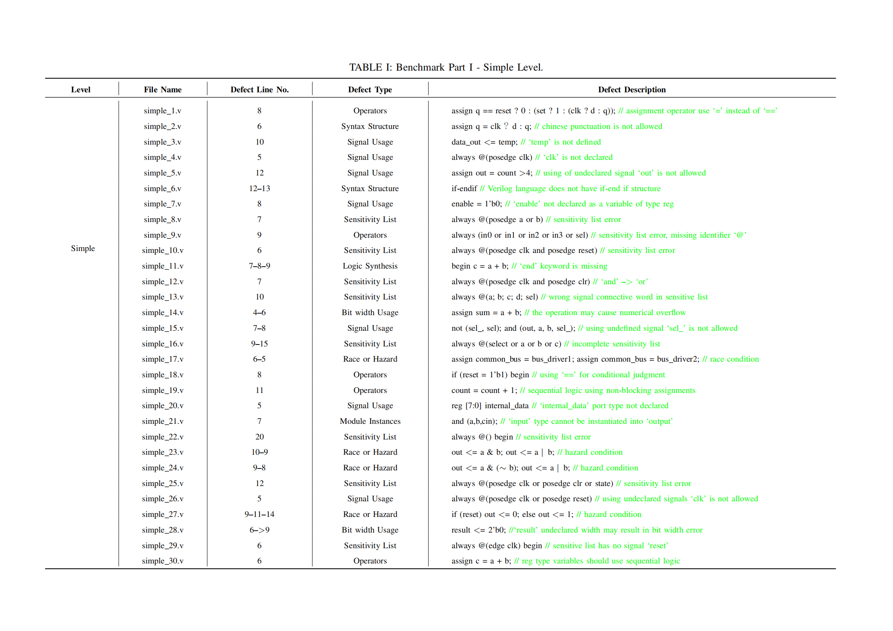
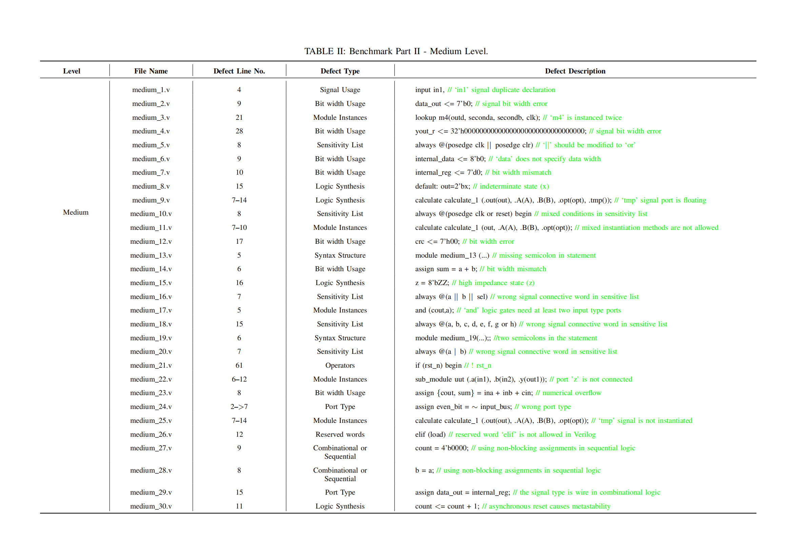
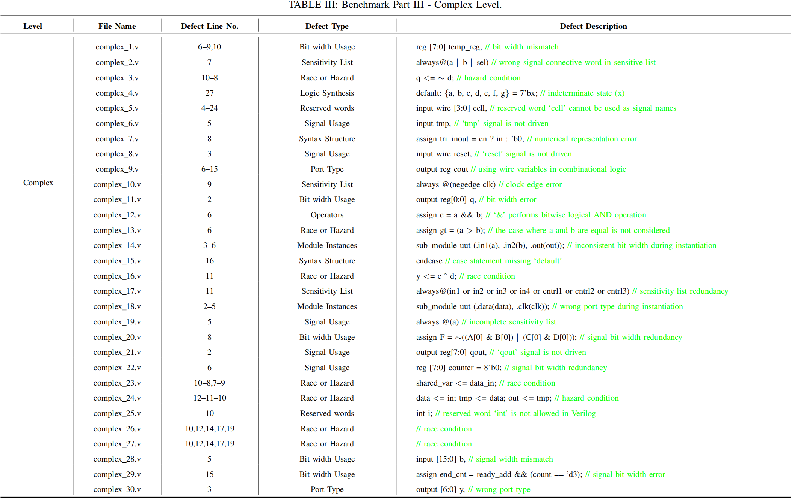
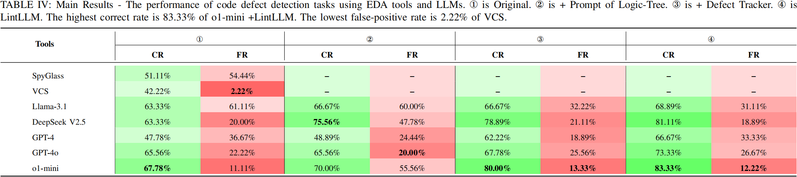
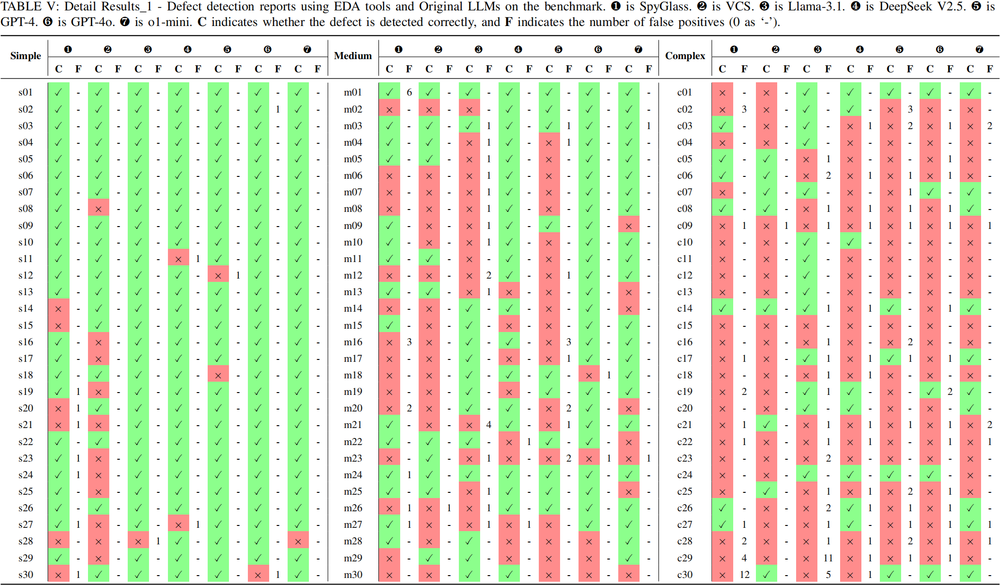
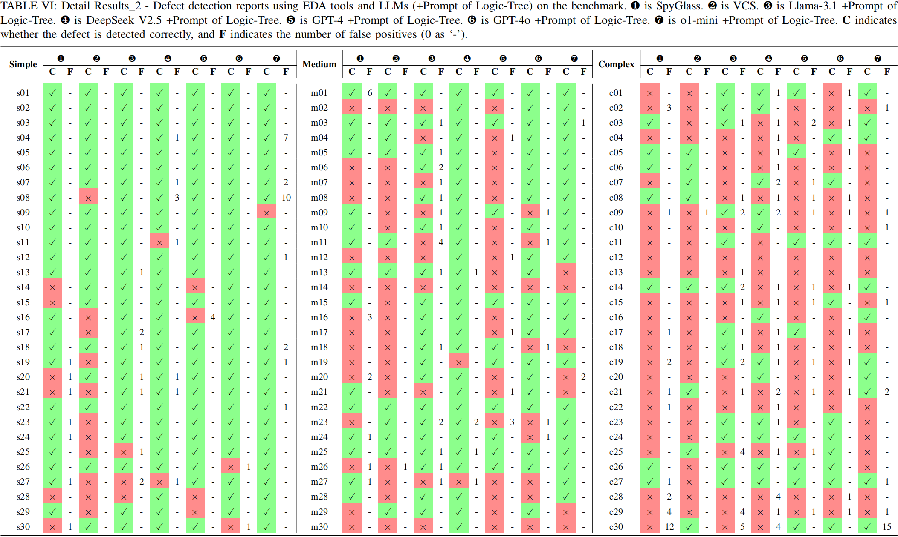
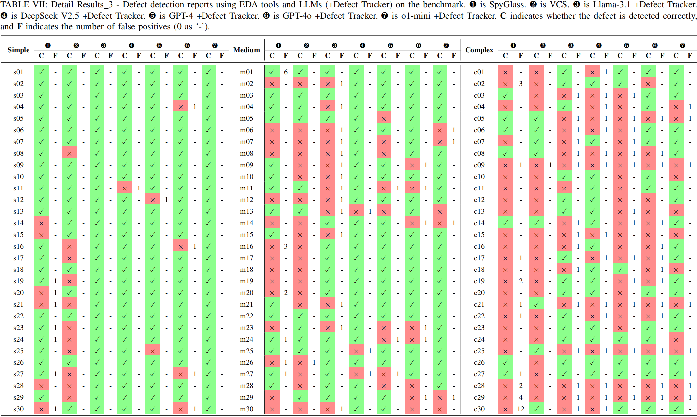
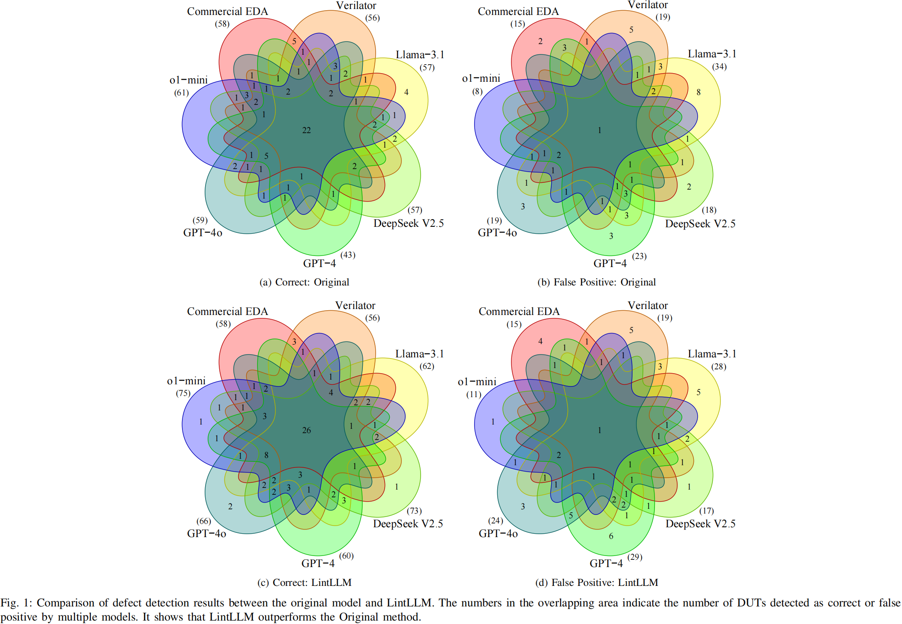
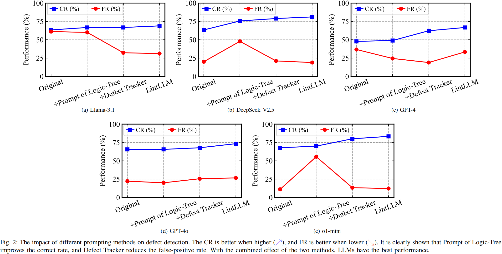

# LintLLM
* The **`Benchmark`** folder contains the benchmarks and detailed description we proposed.  
* The **`Experiment_Results`** folder contains our detailed experimental results.  
* The **`Scripts`** folder contains our experimental code.  

## Benchmark

  

  

## Results

  

  

  

  

  

   

