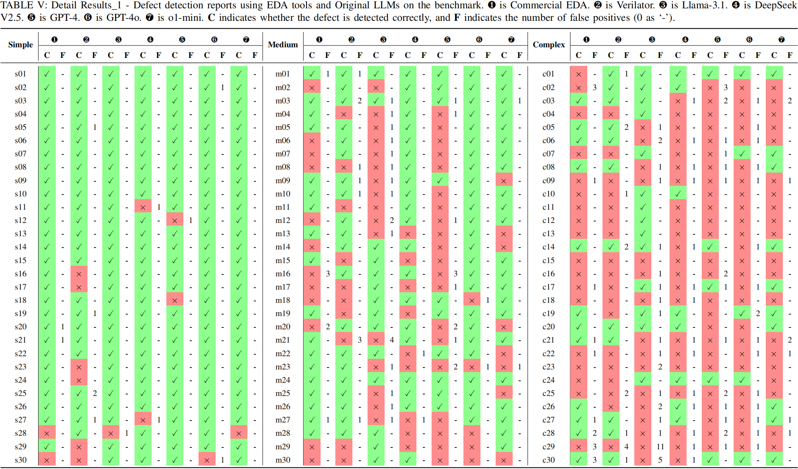

# Static-Verilog-Analysis
* The **`Benchmark`** folder contains the benchmarks and detailed description we proposed.  
* The **`Experiment_Results`** folder contains our detailed experiment results.  
* The **`Scripts`** folder contains our experiment code.  

<!-- ## Benchmark -->
<!--  -->
<!--  -->
<!--  -->
<!-- ## Results -->
<!--  -->
<!--  -->
<!--  -->
<!--  -->
<!--  -->
<!--  -->
<!--  -->

